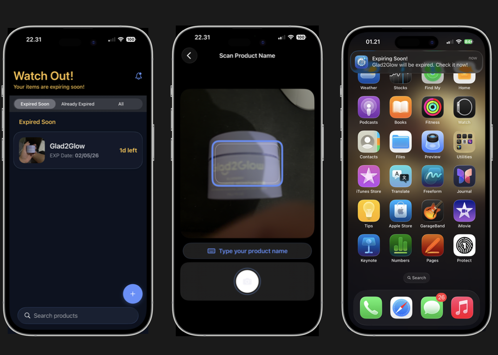

# Exprem

An iOS app that helps busy individuals and households reduce wasted and expired items through quick and easy input, expiration date tracking, and timely reminders before items expire.

## Overview

Exprem makes it effortless to keep track of food and household items so nothing expires unnoticed. Add an item in seconds, and Exprem handles the rest — monitoring expiration dates and reminding you before it's too late.

## Requirements

- iOS 17+
- Xcode 15+
- SwiftUI, SwiftData, Vision, UserNotifications

## Getting Started

1. Clone the repository
2. Open `Exprem.xcodeproj` in Xcode
3. Select a simulator or device (camera features require a physical device)
4. Build and run